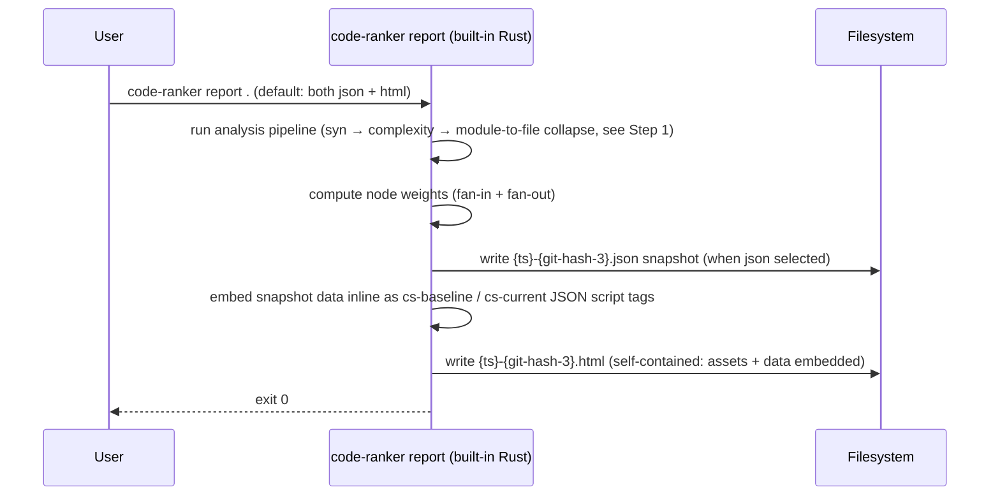
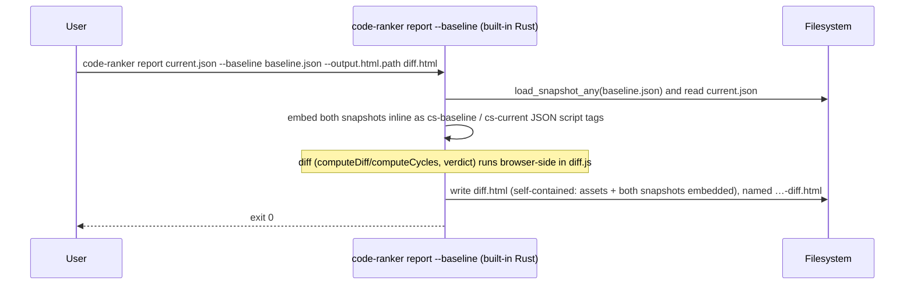
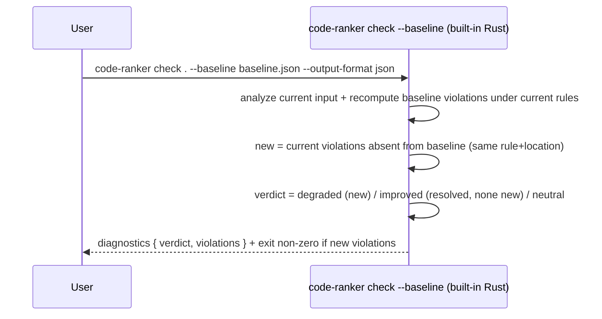

# Technical Design — Code Ranker

<!-- toc -->

- [1. Architecture Overview](#1-architecture-overview)
  - [1.1 Architectural Vision](#11-architectural-vision)
  - [1.2 Architecture Drivers](#12-architecture-drivers)
  - [1.3 Architecture Layers](#13-architecture-layers)
- [2. Principles & Constraints](#2-principles--constraints)
  - [2.1 Design Principles](#21-design-principles)
  - [2.2 Constraints](#22-constraints)
- [3. Technical Architecture](#3-technical-architecture)
  - [3.1 Domain Model](#31-domain-model)
  - [3.2 Component Model](#32-component-model)
  - [3.3 API Contracts](#33-api-contracts)
  - [3.4 Internal Dependencies](#34-internal-dependencies)
  - [3.5 External Dependencies](#35-external-dependencies)
  - [3.6 Interactions & Sequences](#36-interactions--sequences)
  - [3.7 Plugin System](#37-plugin-system)
  - [3.8 CLI Reference and Examples](#38-cli-reference-and-examples)
- [4. Additional Context](#4-additional-context)
- [5. Traceability](#5-traceability)

<!-- /toc -->

> **Component designs.** This is the product technical design — architecture,
> principles, domain model, the plugin/extraction crates and the plugin system.
> The two consumer components have their own design docs: the orchestrator
> binary in [`code-ranker-cli/DESIGN.md`](code-ranker-cli/DESIGN.md) and the
> offline HTML viewer in
> [`code-ranker-viewer/DESIGN.md`](code-ranker-viewer/DESIGN.md).

## 1. Architecture Overview

### 1.1 Architectural Vision

Code Ranker is a pipeline: **extract → evaluate / visualize → (user
modifies) → compare**. The platform is built around a single portable
JSON artifact format that decouples the extraction layer (plugins) from
the consumption layer (the `check` linter and `report` artifact writer).
Either layer can evolve independently as long as the schema version is
respected.

At P1 the platform ships three components:

- **Rust Plugin** (`code-ranker-rust`): a Cargo workspace analyzer built
  on `syn` (syntactic analysis). It builds the Rust module graph and
  collapses it to a single **file graph**; produces a single snapshot
  per run
- **Check** (`code-ranker check`): built into `code-ranker-cli`; analyzes (or
  reads) the input, evaluates cycle rules and thresholds, prints diagnostics,
  and exits non-zero on violation. With `--baseline <snapshot>` it switches
  to a **relative gate** — failing only on *new* violations vs the baseline —
  and emits a verdict (`improved` / `degraded` / `neutral`). Writes no files
- **Report** (`code-ranker report`): built into `code-ranker-cli`; analyzes (or
  reads) the input and writes artifacts — a snapshot `.json` and/or a single
  self-contained offline HTML viewer; all JS/CSS assets embedded in the binary
  via `include_str!`. With `--baseline <snapshot>` the HTML becomes a
  baseline↔current diff with a verdict (one shared union layout where the
  Baseline/Current toggle is a CSS visibility flip so common nodes never move),
  named `…-diff.html`. It also emits two refactoring-guidance formats
  (`--output.prompt` / `--output.scorecard`) — the console counterpart of the
  viewer's Prompt Generator, computed by the `recommend` module

The three pillars of the design are:

1. **JSON-first artifact contract** — the single snapshot is the
   sole handoff between all components; any plugin can feed any
   consumer
2. **Offline-first** — every P1 component runs without network access;
   generated HTML reports inline all assets
3. **Pluggable extraction layer** — the built-in plugins (`rust`,
   `python`, `javascript`) all produce the same JSON artifact, so new
   languages can be added as built-in plugins without touching the
   consumer tools

### 1.2 Architecture Drivers

#### Functional Drivers

| Requirement | Design Response |
|-------------|-----------------|
| `cpt-code-ranker-fr-rust-plugin` | Implemented by the `rust` module of the `code-ranker-plugins` crate (cargo metadata + `syn`), which collapses the module graph to a file graph. Dispatched in-process by `code-ranker-cli`'s `plugin` registry. Outputs a single snapshot `.json`. |
| `cpt-code-ranker-fr-lang-plugins` (Python, JS/TS) | Python: the `python` module of `code-ranker-plugins` using `tree-sitter-python`. JS/TS: the `javascript` / `typescript` modules of `code-ranker-plugins`, thin adapters over the shared `ecmascript` module's engine (`tree-sitter-javascript` / `tree-sitter-typescript`), supporting both ESM and CommonJS. All emit `File` nodes + file→file `uses` edges + `External` library nodes, and measure per-file complexity in their `metrics()` step (the orchestrator writes it). |
| `cpt-code-ranker-fr-file-graph` | All plugins emit a single file graph: `File` nodes with `uses` / `reexports` edges between files, plus `External` library nodes at depth 1 reached by `uses` edges flagged `external: true`. The Rust plugin derives it by collapsing its module graph; Python/JS/TS build it directly from import resolution. |
| `cpt-code-ranker-fr-html-report` | Built-in Rust renderer in `code-ranker-cli`: `report` analyzes (or reads) the input, then renders an HTML template with inline assets alongside the JSON snapshot. |
| `cpt-code-ranker-fr-node-sorting` | Node weight (fan-in + fan-out) is computed at render time and embedded in the HTML; client-side JavaScript sorts the table on user interaction. |
| `cpt-code-ranker-fr-ai-prompts` | HTML: the viewer's Prompt Generator (`export-popup.js`). CLI: the `recommend` module (`code-ranker-cli/src/recommend.rs`) drives the `report --output.prompt` (LLM Markdown for one principle) and `--output.scorecard` (console triage) formats from the snapshot's gate-derived thresholds — advisory, no exit code. |
| `cpt-code-ranker-fr-graph-diff` | Browser-side diff in the HTML viewer (`diff.js` `computeDiff`/`computeCycles`): node/edge set difference on the file graph and `affected` propagation, from the two embedded snapshots. The `check --baseline` regression gate is rule-based (re-evaluates rules on the baseline), not a structured graph diff. |
| `cpt-code-ranker-fr-diff-html-report` | With `report --baseline <snapshot>` the viewer becomes a self-contained diff with color-coded baseline/current views and a verdict; all assets inlined; the file is named `…-diff.html`. |
| `cpt-code-ranker-fr-diff-text-report` | `check --baseline <snapshot> --output-format json` emits the machine-readable verdict (`improved` / `degraded` / `neutral`) and the list of new violations for CI parsing. |

#### NFR Allocation

| NFR ID | Summary | Allocated To | Design Response |
|--------|---------|--------------|-----------------|
| `cpt-code-ranker-nfr-offline` | Zero outbound network calls | All components | Rust plugin: no HTTP; `code-ranker check` / `code-ranker report`: HTML assets embedded in binary, no CDN references in generated output. |
| `cpt-code-ranker-nfr-performance` | ≤ 30 s @ 50k LOC (plugin); ≤ 5 s @ 10k nodes (check/report) | `code-ranker-plugins` (`rust` module), `code-ranker-plugin`, `code-ranker-cli` | Syntactic analysis + the module→file collapse run in seconds (no rust-analyzer); `check` / `report` process a snapshot in a single pass. |
| `cpt-code-ranker-nfr-portability` | JSON artifacts stable within a major version | All components | Schema version field in `meta`; consumers abort on mismatch; additive-only changes within a major version. |

### 1.3 Architecture Layers

```mermaid
flowchart TD
    subgraph step1["Language plugins (Rust binary)"]
        cli["code-ranker-cli<br/>(plugin dispatch via trait)"]
        api["code-ranker-plugin-api<br/>(LanguagePlugin trait)"]
        pr["code-ranker-plugins::rust<br/>(cargo metadata + syn, module→file collapse)"]
        pp["code-ranker-plugins::python<br/>(tree-sitter)"]
        pj["code-ranker-plugins::javascript<br/>(thin adapter)"]
        pt["code-ranker-plugins::typescript<br/>(thin adapter)"]
        eco["code-ranker-plugins::ecmascript<br/>(shared ECMAScript engine)"]
        core["code-ranker-graph<br/>(graph types + JSON schema + metric scaffolding)"]
        cli -->|"dyn LanguagePlugin"| api
        pr -.implements.-> api
        pp -.implements.-> api
        pj -.implements.-> api
        pt -.implements.-> api
        pj --> eco
        pt --> eco
        eco --> core
        pr --> core
        pp --> core
    end

    core -->|"snapshot (one `files` graph)"| artifacts["In-memory or JSON snapshot"]

    subgraph consume["Consumers (built-in Rust)"]
        check["code-ranker check<br/>(code-ranker-cli)"]
        report["code-ranker report<br/>(code-ranker-cli + code-ranker-viewer)"]
    end

    artifacts --> check
    artifacts --> report
    check -->|"diagnostics + exit code (verdict with --baseline)"| gate["CI gate"]
    report -->|"{ts}-{git-hash-3}.{json,html} (-diff.html with --baseline)"| html_report["Snapshot + HTML viewer"]
```



| Layer | Responsibility | Technology |
|-------|---------------|------------|
| Plugin — Presentation | Argument parsing, output routing, artifact writing | `clap`, `anyhow` (Rust) |
| Plugin — Application | Dispatch language plugins, assemble the snapshot | `code-ranker-cli` (Rust) |
| Plugin — Domain | Generic graph model + operations (cycles/hk/stats/snapshot) | `code-ranker-plugin-api`, `code-ranker-graph`, `serde` (Rust) |
| Plugin — Contract | The `LanguagePlugin` trait every language plugin implements; the CLI works only against it | `code-ranker-plugin-api` (Rust) |
| Plugin — Infrastructure | Per-language analysis (one module each in `code-ranker-plugins`, behind the trait; JS/TS share the `ecmascript` module and C/C++ the `cfamily` module as peers) on a shared metric layer (`code-ranker-graph`) | `code-ranker-plugins` (`rust`/`python`/`javascript`/`typescript`/`go`/`c`/`cpp`/`csharp`/`markdown` modules, + shared `ecmascript`/`cfamily`), `code-ranker-graph`, `syn`, `tree-sitter` (Rust) |
| Check | Analyze (or read) input, evaluate rules and (with `--baseline`) regressions, print diagnostics, exit non-zero on violation | `code-ranker-cli` (Rust) |
| Report | Analyze (or read) input, write snapshot JSON + offline HTML viewer (a diff with `--baseline`) | `code-ranker-cli` + `code-ranker-viewer` (Rust), Graphviz WASM bundled in binary, assets embedded via `include_str!` |

## 2. Principles & Constraints

### 2.1 Design Principles

#### JSON Artifact Contract as the Sole Integration Surface

- [x] `p1` - **ID**: `cpt-code-ranker-principle-json-contract`

The single JSON snapshot (one `files` graph plus metadata) is the
ONLY handoff between the plugin layer and the consumer layer. No
in-process coupling between the analysis crates and the report
rendering code is permitted. This contract is versioned via
`schema_version`; consumers abort on a version mismatch.

#### Offline-First

- [x] `p1` - **ID**: `cpt-code-ranker-principle-offline-first`

Every P1 component must work without network access. Generated HTML
files must contain no external resource references. This is a design
constraint, not a preference — it must be verified in CI.

#### Files-Only Graph Model

- [x] `p1` - **ID**: `cpt-code-ranker-principle-files-only`

The model is a **generic property graph** (free-form node/edge `kind` +
attribute maps), but today the snapshot carries exactly one level: **files**.
Node kinds in output are `"file"` (a project source file, carrying all metrics)
and `"external"` (a third-party library at depth 1 — one node per library, never
expanded). The one **information-flow** edge kind is `uses` between files; the
structural `contains` (module ownership), `reexports` (a `pub use` facade), and
`super` (a glob `use super::*` / `use crate::<ancestor>::*` namespace pull from an
enclosing module) are recorded but non-flow — excluded from fan-in / HK / cycles
and not drawn. An edge is external iff its target is an
`external` node. There is no module, function, or call graph yet: plugins resolve
everything to file→file dependencies before the snapshot is written. The `graphs`
map and the per-level semantics dictionaries leave room for `module` / `function`
levels later with no model change.

#### Internal Coupling Excludes External Libraries

- [x] `p1` - **ID**: `cpt-code-ranker-principle-internal-coupling`

`fan_in`, `fan_out`, and Henry-Kafura (`HK = sloc × (fan_in × fan_out)²`)
are computed from **internal** file→file edges only. Edges to `External`
library nodes are excluded from these counts and from HK, and are
surfaced separately in `coupling.fan_out_external`. Rationale: HK
measures internal architectural coupling, not the breadth of 3rd-party
library usage, which would otherwise drown out real structural signal.

#### Pluggable Extraction, Stable Consumers

- [x] `p1` - **ID**: `cpt-code-ranker-principle-pluggable`

The `check` linter and `report` artifact writer are schema consumers, not
language-aware tools. Adding a new language plugin MUST NOT require
changes to any consumer tool. All language-specific knowledge lives
exclusively in the plugin.

#### Metric Accuracy from the Parsed AST

- [x] `p1` - **ID**: `cpt-code-ranker-principle-metric-accuracy`

Metrics and edges are derived from the **parsed syntax tree**, never from text
matching: a detector keys on the actual AST node (an `unsafe` block, an `if`
branch, a `use` path), so a metric keyword that appears only as a look-alike —
an identifier such as `super_unsafe_fn`, a comment, a string/char literal, a
doc-comment, an attribute, or an unexpanded macro body — does not register. This
is what makes the **Metric Accuracy** NFR
(`cpt-code-ranker-nfr-metric-accuracy`) attainable by construction: counting the
real construct yields ground truth, with no false positives from text and no
false negatives from missed nodes. Per-function metrics are summed over the
file's child function spaces, not read from the vacuous file-root value.
Deliberate non-goals — unexpanded macro bodies, `#[cfg(test)]` code, stdlib paths
as external nodes — are defined scope, kept out by design rather than missed.

> The parsed tree is tree-sitter's *concrete* syntax tree (CST) — every token is
> a node — not a classic AST. "AST" here, and the principle name, mean *counted
> from syntax nodes, not text*; that holds for the CST, so the term is used
> loosely throughout.

**Changing a metric — adding one or fixing a bug — follow the runbook
[`docs/metric-correctness.md`](metric-correctness.md):** it maps where
each metric is computed (which crate), the per-task checklist, the normative spec
to define "correct" against (`languages/<lang>/metrics.md`), and which tests
prove it where (the metamorphic / generative / anchor / differential / mutation
layers and the ≤ 20 s budget). Do not change a detector without going through it —
that runbook is how this principle and the Metric Accuracy NFR stay enforced
rather than aspirational.

### 2.2 Constraints

#### Stable Rust Toolchain

- [x] `p1` - **ID**: `cpt-code-ranker-constraint-stable-rust`

The Rust plugin must build on stable Rust. `rustc_private` and
nightly-only features are prohibited.

#### Python 3.9+ Minimum

- [x] `p3` - **ID**: `cpt-code-ranker-constraint-python`

The built-in Python language plugin targets Python 3.9+ as the minimum
version to analyze. No Python runtime is required by the `code-ranker`
binary itself; the constraint applies to the target workspace being
analyzed, not the execution environment.

## 3. Technical Architecture

### 3.1 Domain Model

**Technology**: a **generic property-graph** model. The contract types live in
`code-ranker-plugin-api`; the serializable snapshot and computed-data types live
in `code-ranker-graph`.

The model is deliberately language-agnostic: there are **no** `NodeKind` /
`EdgeKind` / `Visibility` enums and no fixed metric field set. A node has a
free-form string `kind` and a free-form attribute map; a source file is just
`kind == "file"`. The core never interprets `kind`; it reads only the attribute
keys it understands, described per level by the semantics dictionaries.

| Entity | Description | Location |
|--------|-------------|----------|
| Graph | Pure structure: `nodes: Vec<Node>` + `edges: Vec<Edge>`. No computed data. What a plugin's `analyze` returns. | `crates/code-ranker-plugin-api/src/graph.rs` |
| Node | `id: NodeId`, `kind: String` (`"file"` / `"external"` today), `name: String`, `parent: Option<NodeId>`, `attrs: Attributes` (flattened into the JSON object). | `crates/code-ranker-plugin-api/src/node.rs` |
| Edge | `source: NodeId`, `target: NodeId`, `kind: String` (`"uses"` / `"contains"` / `"reexports"` / `"super"`), `attrs: Attributes` (usually empty; e.g. a Rust `reexports` edge carries `visibility`). An edge is **external iff its `target` node is external** — there is no `edge.external` flag. | `crates/code-ranker-plugin-api/src/edge.rs` |
| Attributes | `BTreeMap<String, AttrValue>` (alphabetical → byte-stable). Plugins fill **structural** keys (`path`, `loc`, `visibility`, `version`, `items`, `unsafe` — the Rust plugin's per-file count of `unsafe` usages, `external`, `crate` — the Rust plugin's per-target owning crate, e.g. `bat` / `bat (bin)`, …); the orchestrator adds **computed** keys (`cyclomatic`, `cognitive`, `sloc`, `lloc`, `cloc`, `blank`, `mi`, `mi_sei`, `length`, `vocabulary`, `volume`, `effort`, `time`, `bugs`, `fan_in`, `fan_out`, `fan_out_external`, `hk`, `cycle`) into the same map by node id. All flat — no nesting. Zero-valued metrics are omitted. | `crates/code-ranker-plugin-api/src/attrs.rs` |
| AttrValue | Untagged scalar: `Bool` / `Int` / `Float` / `Str` (serialized to its natural JSON form). Metric producers round to 3 significant digits and store an integral value as `Int` so e.g. `1.0` serializes as `1`. | `crates/code-ranker-plugin-api/src/attrs.rs` |
| NodeId | Stable string key. A **file node's id IS its relativized path** — `{target}/src/a.rs` (no `file:` prefix); an external node is `ext:{name}` (`ext:serde`). During analysis a file id is its absolute path; the orchestrator relativizes it against the named roots. | `crates/code-ranker-plugin-api/src/node.rs` |
| Level | What a plugin can produce, with its semantics dictionaries: `name`, `edge_kinds`, `node_attributes` / `edge_attributes`, `attribute_groups`, plus `node_kinds: BTreeMap<String, NodeKindSpec>` and `cycle_kinds: BTreeMap<String, CycleKindSpec>` (seeded from `default_node_kinds()` / `default_cycle_kinds()`, overridable), plus an optional `grouping: Grouping` telling the viewer how to cluster nodes — `{ key }` (group by a node attribute's value, e.g. `crate`) or `{ function }` (a named viewer grouper, e.g. `dir`). The orchestrator merges the plugin's structural attribute specs with the central complexity + coupling specs, overlays the gate-derived advisory thresholds (from `[rules.thresholds.file]`), computes the `ui` block, then prunes everything to what is actually present. The `node_attributes` dictionary keeps every key carried by *any* node (external included, so the viewer can still label e.g. an external node's `path`), while the `ui` render lists are filtered more tightly to keys present on at least one **internal** (non-external) node — those surfaces (table, summary, sort) never show external rows. | `crates/code-ranker-plugin-api/src/level.rs` |
| EdgeKindSpec | `flow: bool` (single source of truth — counted/drawn when `true`; structural like `contains` when `false`), plus optional `label` / `description`. | `crates/code-ranker-plugin-api/src/level.rs` |
| AttributeSpec | Everything the UI needs to render a metric from data: `value_type`, `label`, `name` (tooltip title), `short` (table header), `description` (the diagnostic *why*), `remediation` (the diagnostic *fix* — both shown by `check`, data not Rust), `formula` (display), `calc` (an `eval`-able JS expression over sibling attrs — the live derivation), `direction` (`higher_better`/`lower_better`, for delta colour; **absent → the Δ stays neutral / uncoloured** — used for raw sizes like `sloc`/`lloc`/`blank` and for `fan_in`/`fan_out` (high coupling is dual — a tangled unit or a legitimate coordinator — so the directional signal lives in `hk` only), which have no agreed "good" way to move), `abbreviate` (K/M — **viewer-only**: the CLI scorecard/prompt always print exact integers), `group`, `thresholds {info, warning}`. All optional but `value_type`. | `crates/code-ranker-plugin-api/src/level.rs` |
| NodeKindSpec / CycleKindSpec | Per-kind UI semantics. `NodeKindSpec`: `label`/`plural`/`fill`/`stroke`/`external`. `CycleKindSpec`: `label`/`description` (the cycle *why*)/`remediation` (the *fix*). `default_node_kinds()` seeds node kinds; `default_cycle_kinds()` seeds only the cycle *keys* (`mutual`/`chain`) — the orchestrator overlays the vocabulary centrally from `code-ranker-graph`'s `cycle_specs()` (the `builtin.toml [cycles.*]` catalog), so no cycle prose lives in Rust. | `crates/code-ranker-plugin-api/src/level.rs` |
| Thresholds | `{ info: f64, warning: f64 }` — two-tier per-metric advisory thresholds overlaid onto the matching `AttributeSpec`; `warning` is the `[rules.thresholds.file]` gate limit, `info` an optional softer line below it (so the report mirrors the gate). | `crates/code-ranker-plugin-api/src/level.rs` |
| Preset | A Prompt-Generator principle: `id`, `label`, `title`, `prompt`, `doc_url?`, `sort_metric`, `connections`. The orchestrator builds a generic default catalog (`code-ranker-cli/src/presets.rs`) and a plugin's `presets(input)` hook may pass through / edit / extend it. Stored top-level in the snapshot. Prompt-generator domain data — lives in its own module, not the parser contract. | `crates/code-ranker-plugin-api/src/preset.rs` |
| PromptTemplate | The language-neutral prompt **scaffolding** the Prompt-Generator wraps a `Preset` in: `intro`, `doc_note`, `task` (bullet lines), `focus`, `cycle_note` (`{id}` substituted at render). Data, not code — sourced from `code-ranker-graph/metrics/prompt.md` (`code-ranker-graph`'s `prompt_template()`), carried top-level in the snapshot so the CLI `prompt` format and the viewer's Prompt Generator render the same text from one source. | `crates/code-ranker-plugin-api/src/preset.rs` |
| CycleGroup | SCC with ≥ 2 nodes: `kind: String` (`"mutual"` for a 2-node SCC, `"chain"` for 3+), `nodes: Vec<NodeId>`. Each member node also carries a `cycle` attribute. | `crates/code-ranker-graph/src/level_graph.rs` |
| LevelUi | Computed UI hints: `default_sort`, `sort`, `size`, `card`, `columns`, `summary` — each a curated metric order filtered to the attributes present on internal nodes, so the viewer renders them verbatim and hardcodes none of it — plus an optional `grouping` (carried through from the level spec, pruned to a usable attribute) telling the viewer how to cluster diagram nodes. | `crates/code-ranker-graph/src/level_graph.rs` |
| LevelGraph | One analysis level in the snapshot: the semantics dictionaries (`edge_kinds`/`node_attributes`/`edge_attributes`/`attribute_groups`/`node_kinds`/`cycle_kinds`) + `nodes` + `edges` + `cycles: Vec<CycleGroup>` + `stats: BTreeMap<String, AttrValue>` (flat averages) + `ui: LevelUi`. | `crates/code-ranker-graph/src/level_graph.rs` |
| Snapshot | The `.json` artifact: `schema_version: "3"`, `generated_at`, `command`, `workspace`, `target`, `plugin`, `config_file?`, `versions`, `roots`, `git?`, `timings`, `graphs: BTreeMap<String, LevelGraph>`, top-level `presets: Vec<Preset>`, and `prompt: PromptTemplate` (the Prompt-Generator scaffolding prose, read by both the CLI and the viewer). Serialized via `to_canonical_string_pretty` — **canonical JSON** (alphabetical keys; `nodes`/`edges` sorted). | `crates/code-ranker-graph/src/snapshot.rs` |
| StageTime | Per-stage timing entry: `stage`, `ms`, `detail`. Stored in `Snapshot.timings` in execution order. | `crates/code-ranker-graph/src/snapshot.rs` |

**Relationships**:

- `Node` → `Node`: linked via `Edge` (`source` → `target`).
- `Graph` → `Node`/`Edge`: ownership; a node carries an optional `parent`
  pointing to a containing node (unused on file nodes today — diagram clustering
  is driven by the level's `ui.grouping`, not the `parent` field).
- Snapshot diff (`--baseline`) is computed **browser-side** by the viewer
  (`diff.js`) from the two embedded snapshots; there is no server-side
  `compare_snapshots` / `CompareSummary` (removed). `check --baseline` gates
  by re-evaluating rules on the baseline, not by a structured graph diff.

### 3.2 Component Model

#### code-ranker-graph

- [x] `p1` - **ID**: `cpt-code-ranker-component-core`

Operations **over** the generic model (defined in `code-ranker-plugin-api`):
cycle detection, Henry-Kafura coupling, aggregate stats, id relativization, and
the serializable `Snapshot` / `LevelGraph` types. Language-agnostic, zero I/O.
Depends on `code-ranker-plugin-api`, `serde`, `chrono`, `anyhow` only — no
`petgraph`, `cargo_metadata`, `syn`, or analyzers. Which edge kinds count as
information flow is **not hardcoded** — every pass takes a `flow_kinds: HashSet<String>`
the orchestrator derives from the level's `EdgeKindSpec.flow`.

Modules:

- **`cycles.rs`** — `annotate_cycles(graph, flow_kinds) -> Vec<CycleGroup>`:
  Kosaraju SCC over flow edges (today just `uses`). `contains`,
  `reexports`, and `super` are non-flow (`EdgeKindSpec.flow = false`), so a `mod foo;`
  parent/child pair, a `pub use` facade hub (`lib.rs` / `mod.rs`), and a
  `use super::*` namespace pull never
  fabricate cycles. An SCC whose members span **more than one crate** is dropped
  — Rust forbids circular crate dependencies, so it can only be a resolution
  artifact (crate identity read from the node `crate` attribute, falling back to
  the path). Classifies each surviving SCC `"mutual"` (2 nodes) or `"chain"` (3+)
  and writes a `cycle` attribute on each member node.
- **`hk.rs`** — `annotate_coupling(graph, flow_kinds)`: writes `fan_in` /
  `fan_out` / `fan_out_external` into each internal node's `attrs`. `fan_in` /
  `fan_out` count unique **internal** flow partners only; edges whose target is
  external are counted into `fan_out_external` instead. Zero values are omitted.
  The size-folding `hk` (`hk = sloc × (fan_in × fan_out)²`) is **not** computed
  here: it is a graph-derived `[fields.hk]` CEL formula evaluated by
  `builtin::write_derived` once these counts are on the node (TIER1 → graph →
  TIER2).
- **`stats.rs`** — `compute_stats(graph) -> BTreeMap<String, AttrValue>`: the
  mean of each tracked numeric metric across the file nodes (zero/missing values
  excluded; a metric emitted only when its average is positive).
- **`finalize.rs`** — `finalize_graph`: drop self-loops, dedup edges on
  `(source, target, kind)`, prune unreferenced external nodes, sort.
- **`snapshot.rs`** — the top-level `Snapshot` artifact (`schema_version`,
  header, `graphs` map, `presets`) plus its header types `GitInfo` / `StageTime`.
- **`level_graph.rs`** — the widely-imported per-level payload types: `LevelGraph`
  (graph + semantics dictionaries + computed cycles/stats/UI), `LevelUi`, and
  `CycleGroup`. Split out from `snapshot.rs` so their fan-in lands here, not on
  the artifact module (keeps each file's Henry-Kafura low).
- **`relativize.rs`** — `relativize_graph` / `relativize_level`: map absolute
  file paths to `{target}` / `{registry}` / … tokens (following edges, parents
  and cycle node lists) and drop a file node's redundant `path`.
- **`serialize.rs`** — **canonical serialization** (`to_canonical_string` /
  `to_canonical_string_pretty`): round-trips through `serde_json::Value` (a
  `BTreeMap`, so keys come out alphabetical) and sorts `nodes` by `id` and
  `edges` by `source`/`target`/`kind`, byte-stable for unchanged input. Generic
  over any `Serialize`; depends on nothing else in the crate.
- **`attrs.rs`** — the shared attribute helpers every enrichment pass pulls in:
  `round_sig3` / `num_attr` (numeric rounding + the `f64 → AttrValue` bridge) and
  the `attr_f64` / `is_external` reads/predicate. A **leaf** module that depends
  only on the plugin API, never on the crate root — so the passes import helpers
  from here instead of `use crate::…`, which would otherwise close a
  `submodule → lib.rs → submodule` dependency cycle.
- **`lib.rs`** — declares the submodules (`pub mod attrs; … pub mod stats;`) and
  re-exports `builtin`'s data-driven catalog accessors — `coupling_specs()` (the
  coupling/cycle `AttributeSpec`s + the `coupling` group), `cycle_specs()` and
  `prompt_template()` (cycle vocab + prompt scaffolding from `builtin.toml`), all
  merged in by the orchestrator — and re-exports the crate's main items
  via a `pub use` prelude (`code_ranker_graph::Snapshot`, `…::annotate_cycles`,
  …) for ergonomic imports. This is **metric-neutral**: `pub use` emits
  `reexports` edges, which are non-flow, so they do not count toward `fan_out` /
  HK / cycles — the root stays off the coupling metrics regardless of the
  prelude. (An earlier revision dropped the prelude believing it inflated HK;
  once `reexports` became non-flow that was unnecessary, so the ergonomic
  prelude is back.) (There is no server-side snapshot-diff module — `--baseline`
  diffing is done browser-side by the viewer's `diff.js`.)

This crate also hosts the **language-neutral metric scaffolding** (modules
`metrics.rs` + `registry.rs`). The split is **tier-1 is measured in Rust;
tier-2 is data**:

- The **one generic tree-sitter metric engine** (`code-ranker-plugins/src/engine/`)
  measures tier-1 counts, parameterized per language by a thin `Dialect` (in each
  `languages/<lang>/dialect.rs`) plus that language's `config.toml` role tables.
  It is a single faithful port of `rust-code-analysis`'s node-kind rules
  (`rust-code-analysis` is **not a dependency**). `engine::compute()` returns a
  `code_ranker_plugin_api::MetricInputs` (η₁/η₂/N₁/N₂, `spaces`/`branches`, LOC,
  `cognitive`/`exits`/`args`/`closures`, `span_sloc`) — the tier-1 *measured*
  counts.
- **Derived metrics are declarative**: a CEL `formula_cel` + display spec per
  metric, defined in `code-ranker-graph/metrics/builtin.toml` (`[fields.*]`) and
  evaluated by the registry engine (`registry.rs`, built on the `cel` crate;
  `log2`/`ln`/`pow`/`sqrt`/`sin` are host functions). `write_metrics(node,
  &MetricInputs)` writes the tier-1 values (LOC block gated on `sloc > 0`) plus
  the registry-derived values; `metric_specs()` reads the spec catalog from the
  same file. Both come from the graph crate's `builtin` module (`builtin.rs`,
  which reads `builtin.toml`); the tier-1 input types `MetricInputs` /
  `FunctionUnit` live in `code-ranker-plugin-api` (a plugin measures and returns
  them; the orchestrator calls `write_metrics`). No derived-metric name is
  hardcoded in Rust.

The registry runs per **unit**: the same `MetricInputs` → metrics path serves the
file node and (with the `functions` level on) each function node. User metrics
(`[metrics.<key>]`) run through the same registry — node-scope per-unit formulas,
or graph-scope `agg(key, reducer, population)` aggregates emitted into `stats`.

Each metric is dropped at its **no-signal value** (`AttributeSpec.omit_at`,
published in the spec and read by the writer, so emission and spec never drift):
`0` for almost everything, `1` for `cyclomatic` (McCabe's straight-line floor, so
a function-less file drops it rather than reporting a vacuous `1`).
`metric_specs()` exposes the `AttributeSpec`s + their groups (complexity /
halstead / loc / maintainability), which the orchestrator merges into each level's
dictionaries and prunes to the keys present. Built-in metric groups:

| Group | Keys |
|----------|------|
| complexity | `cyclomatic`, `cognitive`, `exits`, `args`, `closures` |
| maintainability | `mi`, `mi_sei` |
| loc | `sloc`, `lloc`, `cloc`, `blank` |
| halstead | `length`, `vocabulary`, `volume`, `effort`, `time`, `bugs` |

A plugin may refine a spec's wording for its language via the
`LanguagePlugin::metric_specs` hook (e.g. the Rust plugin appends the
`#[cfg(test)]`/`#[test]`-exclusion note to `sloc` / `lloc` / `cloc` / `blank`, so
that nuance appears only in Rust snapshots).

Coupling (`fan_in` / `fan_out` / `fan_out_external`) and `cycle` are added later by
this crate's `annotate_coupling` / `annotate_cycles` passes; `hk` is then derived
from the coupling counts by the `write_derived` (graph-derived `[fields.*]`) step.

#### code-ranker-plugin-api

- [x] `p1` - **ID**: `cpt-code-ranker-component-plugin-api`

The **foundation** crate: it defines the generic model (`Node` / `Edge` /
`Graph` / `Attributes` / `AttrValue` / `Level` + the `EdgeKindSpec` /
`AttributeSpec` / `AttributeGroup` spec types) and the single trait,
`LanguagePlugin`. It depends on **nothing** of ours (only `serde` + `anyhow`);
every other crate depends on it. The model lives in topic submodules (`attrs` / `edge` / `graph` /
`level` / `node` / `plugin`), re-exported from the crate root via a `pub use`
prelude (`code_ranker_plugin_api::Node`, `…::Graph`, …) for ergonomic imports.
This is metric-neutral — `pub use` emits non-flow `reexports` edges, so the
prelude adds no `fan_out` / HK to the root.

`LanguagePlugin` is a **pure parser** contract — `name`, `detect(ws, input)`
(can-parse, replacing markers), `levels` (the levels + their semantics
dictionaries), `analyze(ws, input) -> Graph` (**structure only**, no
metrics; when `input.ignore_tests` is set the plugin drops its own test files
here — test detection is language-specific, so it lives in the plugin, not the
CLI), `versions` (e.g. `rustc`). `PluginInput` carries the `ignore` globs and the
`ignore_tests` / `gitignore` / `ignore_files` / `hidden` walk flags, and is a
plain struct so input can grow without breaking implementors.

The CLI works **only** against `dyn LanguagePlugin` and never names a concrete
language. Plugins **self-register**: each module in `code-ranker-plugins` submits
itself with `inventory::submit! { PluginRegistration(&XPlugin) }`, and the binary
collects them via `code_ranker_plugin_api::registry() -> Vec<&'static dyn
LanguagePlugin>` (the `inventory` crate's distributed slice). Dispatch (`analyze`),
`detect`, `resolve_plugin`, and `versions` all iterate that array. Adding a language
is: implement the trait in a module and add one `inventory::submit!` — **no central
list to edit** anywhere (the CLI, `plugin::registry()`, and `lib.rs` are untouched).
Link order is not significant: auto-detect errors on multiple matches rather than
picking by position. A `LanguagePlugin::config() -> toml::Table` accessor surfaces a
plugin's fully-merged config for `--export-full-config`.

#### code-ranker-plugins · rust module

- [x] `p1` - **ID**: `cpt-code-ranker-component-syn`

The Rust language plugin (the `rust` module of the `code-ranker-plugins` crate;
implements `LanguagePlugin`; analysis in `analyze`), dispatched by
`code-ranker-cli`. It produces the Rust module graph via syntactic
analysis and collapses it to a file graph (see §3.7) before returning a generic
`api::Graph` — **structure only from `analyze`** (its `metrics()` step measures
complexity separately, producing a `code_ranker_plugin_api::MetricInputs` with the
shared generic engine via its Rust `Dialect`; the orchestrator then writes the
derived metrics via `code_ranker_graph::write_metrics`).
It builds with a module-local typed model (`rust/internal.rs` — `Node` / `Edge` /
`Visibility`) for the syn/collapse passes and converts to the generic model at
the boundary, so the `code-ranker-plugins` crate depends on `code-ranker-plugin-api`
and `code-ranker-graph` only (not `rust-code-analysis`).
Calls `cargo metadata` **with `--offline`** (code-ranker never hits the network —
it resolves from the warm cargo cache, surfacing an actionable error otherwise);
classifies crates as local vs. external; walks local source trees with `syn` to
extract the module hierarchy and `use` / `pub use` statements, emitting internal
crate / module / trait nodes and `contains` / `uses` / `reexports` / `super` edges
(`super` = a glob `use super::*` / `use crate::<ancestor>::*` reaching back into an
enclosing module — non-flow scope-sugar, or a real back-dependency the analyzer
can't tell apart, so kept non-flow as a low-priority cycle; see
`cycles.md`). It also runs a `syn::visit`
path collector over each file to capture **bare qualified paths** in
expressions/types (≥ 2 segments, no `use`) **and qualified paths inside
`#[derive(...)]`** (e.g. `serde::Serialize`), resolved through the same
full resolver as `use` statements.

Resolution runs in **two phases** so cross-crate edges can be submodule-precise:
phase A walks every workspace crate, building all module nodes and a per-crate
library module index; phase B then resolves the collected `use` / bare-path
references against (1) the owning crate's index (intra-crate / `crate` / `self`
/ `super`), (2) the **workspace libraries** (each a module index + `pub use`
re-export table) — a cross-crate `other_crate::sub::Item` walks the dependency
crate's index to the file that owns `Item` (→ its `sub.rs`), falling back to the
crate root when the path stops at a root item — and (3) the extern-crate map
(registry deps → one crate-root / `External` node). `std`/`core`/keyword-only
paths are ignored; external crates are added as `Crate` nodes with
`external = true` and their source is never read. Resolution is
**re-export-aware**, both intra- and cross-crate: when a path's trailing segment
is not a submodule but a symbol the resolved module re-exports
(`pub use error::DomainError`, or another crate's `pub use access_scope::AccessScope`),
it follows the `pub use` chain to the file that **defines** the symbol instead of
anchoring on the facade — so `crate::X` / `super::X` and `other_crate::X` land on
the definer, not on a 17-line `lib.rs` / `mod.rs` hub (which would otherwise
collect a huge false `fan_in`). Module
node ids are namespaced **per target** (`mod:{pkg}::{kind}:{name}::…`): a package
exposing a library and a same-named binary (`bat` lib + `bat` bin) keeps two
distinct module trees, so `crate::X` in the library never mis-resolves onto the
binary's `main.rs` (which would otherwise invent an impossible library→binary
edge and an inflated `main.rs` fan_in). Each module records its owning crate,
surfaced on the collapsed file node as the per-target `crate` attribute. A
per-package `visited_files` `HashSet<PathBuf>` guard prevents double-walking
source files when a workspace has both `lib` and `bin` targets declaring the
same modules. A `mod` with `#[path = "…"]` is resolved via that
attribute (relative to the declaring file's directory) before the default
`name.rs` / `name/mod.rs` lookup.

These module-level nodes are **internal**: the Rust plugin's collapse
pass (see §3.7) folds them down to file nodes (`kind == "file"`, id = the
file's absolute path) and external library nodes (`ext:{name}`, carrying
`external: true`, the resolved `version`, and the dependency's source `path`)
before returning. The orchestrator then relativizes the absolute file ids to
`{target}/…` and the external `path` to `{registry}/…`.

**Edge sources & remaining blind spots**: file→file / file→library edges
come from three sources — (1) `use` / `pub use` statements; (2) bare
qualified paths in expressions/types (`commands::run()`, `other_crate::item`,
`crate::a::Alpha`); (3) qualified paths inside `#[derive(...)]`
(`serde::Serialize`) — all resolved the same way as `use`. A `mod foo;`
declaration emits a `Contains` edge that is kept in the JSON but treated as
structural ownership only — not drawn, not counted in fan_in / HK / cycles.
What remains uncaptured: any path **inside a macro body** (the macro's own path
is recorded, e.g. `anyhow::bail!`, but the tokens it wraps are not — macros are
never expanded), an old-style `extern crate foo;` (no path), and a cross-crate
reference into a registry dependency (no local module index) which still
collapses onto the single `External` node. A file reached only via `Contains`
(e.g. a module declared with `mod foo;` but never referenced by path or `use`)
has `fan_in` 0 and can appear isolated on the map.

**Metric engine**: the Rust plugin uses the shared generic engine
(`code-ranker-plugins/src/engine/`) via its Rust `Dialect`
(`languages/rust/dialect.rs` + `languages/rust/config.toml`); its `metrics()`
calls `engine::compute()` to produce a `code_ranker_plugin_api::MetricInputs`, and
the orchestrator writes the derived metrics via `code_ranker_graph::write_metrics`. The engine is
a faithful port of `rust-code-analysis`'s node-kind rules, resolving node kinds
**by name** so it is grammar-version-robust (`rust-code-analysis` is **not a
dependency**). **Rust-only
pre-pass**: before measuring a `.rs` file, `strip_cfg_test` (a `syn` walk) removes
`#[cfg(test)]` / `#[test]` / `#[bench]` items, so `sloc` and everything derived
from it (`hk`, `mi`, Halstead, cyclomatic/cognitive) count **production** code
only — inline unit tests don't inflate a file's size or coupling. The removed line
count becomes `tloc` (test lines), and the raw `loc` (set by the plugin from the
full file) is unchanged, giving `loc = sloc + cloc + blank + tloc`. (The flat
metric keys, omit-at gating, and `metric_specs()` catalog are the language-neutral
scaffolding in `code-ranker-graph`; see that component.)

#### code-ranker-plugins · python module (built-in)

- [x] `p3` - **ID**: `cpt-code-ranker-component-python-plugin`

In-process Python plugin implemented in the `python` module of the
`code-ranker-plugins` crate (`code-ranker-plugins/src/languages/python/mod.rs`).
Uses `tree-sitter-python` (a direct dependency) for AST traversal and the shared
`crate::walk` (the `ignore` crate) for file discovery.

**Pipeline**:

1. **Scan** — walk all `.py` files under the workspace, skipping `.venv`,
   `__pycache__`, `node_modules`, hidden directories, and (by default) anything
   matched by `.gitignore` / `.ignore` — see the `[ignore]` config.
2. **Module index** — derive dotted module paths from file paths:
   `parser/shops/amazon/pdp.py` → `parser.shops.amazon.pdp`;
   `parser/shops/amazon/__init__.py` → `parser.shops.amazon`.
3. **Per-file node** — emit one `File` node per `.py` file.
4. **Import resolution** — resolve `import_statement` and
   `import_from_statement` nodes. Imports that resolve to a project file
   emit a file→file `uses` edge (including `__init__.py` package imports,
   which point at the package's `__init__.py` file); relative imports
   (`.`, `..`, `.submodule`) are resolved against the current module's
   package path. Imports that do not resolve to a project file produce an
   `External` library node (`ext:<top-level-package>`, one per top-level
   package such as `numpy`) reached by a `uses` edge flagged
   `external: true`.

It implements `LanguagePlugin` (`analyze` returns a generic `api::Graph`,
structure only). `detect` matches
`pyproject.toml` / `setup.py` / `setup.cfg`.

**ID scheme**:
- File: the file's absolute path (relativized to `{target}/...` by the
  orchestrator; no `file:` prefix)
- External library: `ext:numpy` (carries `external: true`)

**Visibility heuristic**: emitted as a `visibility` string attr — `__name`
(no trailing dunder) → `private`; `_name` → `restricted`; otherwise → `public`.

**Complexity** is written by the plugin's `metrics()` (behind the
`LanguagePlugin` trait): for each `.py` file node it runs the shared generic
engine's `compute()` (via the Python `Dialect` in `languages/python/dialect.rs`,
with `languages/python/config.toml`), producing a
`code_ranker_plugin_api::MetricInputs`; the orchestrator then writes the
derived metrics via `code_ranker_graph::write_metrics`.

#### code-ranker-plugins · ecmascript module (shared engine)

- [x] `p3` - **ID**: `cpt-code-ranker-component-ecmascript`

The **grammar-agnostic ECMAScript engine** both the `javascript` and `typescript`
modules are built on (the `ecmascript` module of the `code-ranker-plugins` crate).
It owns the file walker (`analyze_ecmascript`), the
import/require specifier extractor + resolver, source-root detection, the
`uses`-edge model (test-file detection folded into the walker), `ecmascript_level`,
`external_package`, and the metric helper `ecmascript_metrics`. The
concrete tree-sitter grammar is **injected by the caller** (each plugin passes its
own `tree-sitter-javascript` / `tree-sitter-typescript` `Language` + extension
set), so this module names no language. It exists so the shared ECMAScript logic
lives in a neutral module rather than inside one language plugin — making the JS and
TS plugins **peers** that both depend on it, with **no plugin-to-plugin
dependency**. Its `ecmascript_metrics` helper runs the shared generic
engine via the ECMAScript `Dialect` (`languages/ecmascript/dialect.rs` +
`config.toml`) — `engine::compute()` returns a `code_ranker_plugin_api::MetricInputs`,
which the orchestrator writes via `code_ranker_graph::write_metrics`. The
`code-ranker-plugins` crate depends only on `code-ranker-plugin-api` (the
`MetricInputs` contract lives there); `code-ranker-graph` is a test-only
dev-dependency, so the enrichment crate never leaks into the plugin library.

#### code-ranker-plugins · javascript module (built-in)

- [x] `p3` - **ID**: `cpt-code-ranker-component-js-plugin`

A **thin adapter** implemented in the `javascript` module of the
`code-ranker-plugins` crate (`code-ranker-plugins/src/javascript/mod.rs`,
`name = "javascript"`, `detect` = a `package.json` marker). It binds the
`tree-sitter-javascript` grammar to `.js`/`.jsx`/`.mjs`/`.cjs` and delegates all
real work to the shared **`ecmascript`** module's engine (the walker /
import-specifier extractor / resolver / `ecmascript_level` / metric helper). The
shared engine is grammar-agnostic — the grammar is injected by the plugin — so the
JS and TS plugins are **peers over the same core**, and neither depends on the
other (the old `typescript → javascript` plugin edge is gone). It depends (via the
`code-ranker-plugins` crate) on `code-ranker-plugin-api` + `tree-sitter-javascript`.

The shared walker (in the `ecmascript` module) does **source-root
detection** and the **scan pipeline** below; the JS/TS plugins only choose the
grammar + extensions.

**Source root detection**: if `src/` exists in the workspace, scans from
`src/`; otherwise scans from the workspace root. This avoids picking up
non-source `.js` files (config, scripts, test fixtures) in projects that
follow the `src/` layout convention.

**Pipeline**:

1. **Scan** — walk `.ts`, `.tsx`, `.js`, `.jsx` files from source root (via the
   shared `crate::walk`), skipping `node_modules`, `dist`, `.venv`, hidden
   directories, `.gen.ts`, `.config.ts/js`, and (by default) anything matched by
   `.gitignore` / `.ignore` — see the `[ignore]` config.
2. **File index** — map each file's relative path to its absolute path.
3. **Per-file node** — emit one `File` node per source file.
4. **Import resolution** — resolve ES `import` statements and CommonJS
   `require()` calls. Imports that resolve to a project file emit a
   file→file `uses` edge; handles the `@/` path alias (→ source root),
   relative paths, and index-file collapsing (extensions tried in order:
   `.ts`, `.tsx`, `.js`, `.jsx`, `index.ts`, `index.tsx`, `index.js`,
   `index.jsx`). Imports that do not resolve to a project file produce an
   `External` library node (`ext:<package>`, one per top-level package —
   `react`, `@scope/pkg`) reached by a `uses` edge flagged
   `external: true`.

**ID scheme**:
- File: the file's absolute path (relativized to `{target}/...`; no `file:` prefix)
- External library: `ext:react`, `ext:@scope/pkg` (carries `external: true`)

**Visibility**: JS/TS have no visibility; every file node gets `visibility:
"public"`.

**Complexity** is written by the plugin's `metrics()` (behind the
`LanguagePlugin` trait), which delegates to the shared `ecmascript` module's
`ecmascript_metrics` helper (the shared generic engine via the
ECMAScript `Dialect` + `code_ranker_graph::write_metrics`) for each
`.js`/`.jsx`/`.mjs`/`.cjs` file node.

#### code-ranker-plugins · typescript module (built-in)

- [x] `p3` - **ID**: `cpt-code-ranker-component-ts-plugin`

In-process TypeScript plugin (the `typescript` module of the
`code-ranker-plugins` crate; `name = "typescript"`, scans
`.ts`/`.tsx`/`.mts`/`.cts`, `detect` = a `tsconfig.json` marker). Like the JS
plugin, it is a thin adapter over the shared **`ecmascript`** module's
engine: it drives `analyze_ecmascript`, passing the `tree-sitter-typescript`
grammars (`LANGUAGE_TYPESCRIPT` for `.ts`/`.mts`/`.cts`, `LANGUAGE_TSX` for
`.tsx`) and a TS-first candidate-extension order, plus `ecmascript_level`;
`detect_with_marker` comes from `code-ranker-plugin-api`. **It depends on
the `ecmascript` module, NOT on the JavaScript plugin** — the two are
siblings over a shared core (no plugin-to-plugin dependency). Same id scheme and
visibility as the JS plugin. **Complexity**: its `metrics()` reuses the shared
`ecmascript_metrics` helper with the TypeScript grammars
(`else_if_via_else_clause` = true for `.ts`/`.mts`/`.cts`, false for `.tsx`).

#### code-ranker-cli · recommendation engine

> **Moved.** The orchestrator binary (`cpt-code-ranker-component-cli`) — plugin
> dispatch (over the plugin-api self-registered registry), the shared analysis
> core, the `check` linter and `report`
> artifact writer — and the recommendation engine
> (`cpt-code-ranker-component-recommend`, the console counterpart of the viewer's
> Prompt Generator) are documented in
> [`code-ranker-cli/DESIGN.md`](code-ranker-cli/DESIGN.md).

#### HTML assets (`crates/code-ranker-viewer/src/assets/`)

> **Moved.** The viewer assets (`cpt-code-ranker-component-html-assets`) — the
> data-driven `schema.js` layer, the `grouping.js` ladder, the browser-side diff
> (`diff.js`), the map render/interaction/popup/table/export/shell files (split
> out of the former `diagram.js` / `app.js` / `node-table.js`), the concern-split
> stylesheet, plus the navigation (tier / focus / reveal depth) / affected-status /
> cycle-detection / offline-guarantee notes — are documented, layer by layer, in
> [`code-ranker-viewer/DESIGN.md`](code-ranker-viewer/DESIGN.md).

### 3.3 API Contracts

Interfaces are defined in PRD §7. This section notes the implementation
binding.

#### Unified CLI (`cpt-code-ranker-interface-cli`)

> **Moved.** The implementation binding for the unified CLI is in
> [`code-ranker-cli/DESIGN.md`](code-ranker-cli/DESIGN.md#unified-cli).

#### Plugins (built-in, in-process)

Plugins are not external binaries. The three plugins — `rust`, `python`,
`javascript` — are compiled into the `code-ranker` binary and invoked
in-process; each writes its graphs directly into the shared `GraphBuilder`.
See [§3.7 Plugin System](#37-plugin-system).

#### Report Generator (`cpt-code-ranker-interface-report-cli`) · Check / Regression Gate (`cpt-code-ranker-interface-check-cli`)

> **Moved.** The implementation bindings for the `report` generator and the
> `check` / regression gate are in
> [`code-ranker-cli/DESIGN.md`](code-ranker-cli/DESIGN.md#report-generator). The
> HTML rendering side (`render_html_viewer` and the embedded assets) is in
> [`code-ranker-viewer/DESIGN.md`](code-ranker-viewer/DESIGN.md).

#### Graph JSON Schema (`cpt-code-ranker-interface-graph-schema`)

- **Location**: defined by `Snapshot`, `Node`, `Edge` structs in
  `crates/code-ranker-graph/src/`
- **Versioning**: `schema_version: "3"`; additive fields are minor;
  breaking changes require a major-version bump

### 3.4 Internal Dependencies

| Consumer | Dependency | Interface |
|----------|------------|-----------|
| `code-ranker-cli` | `code-ranker-plugin-api` | `LanguagePlugin` trait — the only contract the CLI uses to talk to plugins |
| `code-ranker-cli` | `code-ranker-plugins` (`rust`/`python`/`javascript`/`typescript`/`go`/`c`/`cpp`/`csharp`/`markdown` modules) | each **self-registers** via `inventory::submit!`. The CLI references NO symbol from this crate — a single `extern crate code_ranker_plugins as _;` link-anchor in `main.rs` pulls it in so the submissions are collected by `code_ranker_plugin_api::registry()`. All shared functionality (the merge, the list-override DSL) lives in `code-ranker-plugin-api`, not here. |
| `code-ranker-cli` | `code-ranker-graph` | `Snapshot`/`LevelGraph`, `annotate_cycles`/`annotate_coupling`/`write_derived`/`compute_stats`, `relativize_graph`, `finalize_graph`, `coupling_specs`, `metric_specs()` (the metric attribute catalog), canonical serialization |
| `code-ranker-cli` | `code-ranker-viewer` | `render_html_viewer()`, `extract_embedded_snapshot()` |
| `code-ranker-plugins` (`rust`/`python`/`javascript`/`typescript`/`go`/`c`/`cpp`/`csharp`/`markdown` modules) | `code-ranker-plugin-api` | `impl LanguagePlugin` (name/detect/levels/analyze/metrics/versions/roots/metric_specs); generic `detect_with_marker` |
| `code-ranker-plugins` (`rust`/`python`/`ecmascript`/`go`/`cfamily`/`csharp` modules) | `code-ranker-graph` | `MetricInputs` + `write_metrics` (the neutral metric scaffolding); all measure tier-1 counts via the **one shared generic engine** (`src/engine/`), parameterized by each language's `Dialect` + `config.toml` |
| `code-ranker-plugins` (`javascript`/`typescript` modules) | `code-ranker-plugins` (`ecmascript` module) | shared ECMAScript walker/resolver + ECMAScript `Dialect` + `ecmascript_level` + `ecmascript_metrics`; each injects its own grammar. **Neither plugin depends on the other.** |
| `code-ranker-graph` | `code-ranker-plugin-api` | the generic model it operates on; the metric scaffolding (modules `metrics` + `builtin`) builds `MetricInputs`/`metric_specs` on its `AttributeSpec` / `AttrValue` types |
| `code-ranker-viewer` | `code-ranker-graph` | `Snapshot`, `to_canonical_string` |
| `code-ranker-cli` (`run_report`) | the analyzed snapshot (+ optional `--baseline`) | top-level metadata + `graphs` map; rendered via `code-ranker-viewer` |
| `code-ranker-cli` (`run_check`) | the analyzed snapshot | `graphs` map; per-rule violation evaluation (relative gate re-evaluates the baseline's rules) |

**Rules**:

- No circular dependencies among the Rust crates; **everything depends on
  `code-ranker-plugin-api`** (the bottom of the graph).
- **No plugin depends on another plugin.** Plugins are peers behind the trait;
  shared machinery lives in neutral crates / modules (`code-ranker-plugin-api`,
  `code-ranker-graph`, the `ecmascript` module of `code-ranker-plugins`),
  never inside a concretely-named language plugin module. JS and TS share
  the `ecmascript` module as siblings; the generic `detect_with_marker`
  lives in `code-ranker-plugin-api`.
- **The `LanguagePlugin` trait (in `code-ranker-plugin-api`) is the only contract
  between the CLI and the language plugins.** No code names a concrete plugin:
  each module **self-registers** with `inventory::submit!`, and the binary collects
  them via `code_ranker_plugin_api::registry() -> Vec<&'static dyn LanguagePlugin>`.
  Everything else (dispatch, marker-based auto-detect, version metadata, metrics)
  iterates that array and never hardcodes a language. Adding a language = add a
  module (implementing `analyze` + `metrics`) with one `inventory::submit!` — no
  central list to touch (an exact-set test in the CLI guards which plugins ship).
- Only the `rust` module of `code-ranker-plugins` uses `cargo_metadata` and `syn`
  (the whole crate carries those deps, but only the `rust` module uses them), and
  toolchain knowledge (cargo/rustup/`rustc`, the snapshot `roots`) lives **inside**
  it via `LanguagePlugin::roots` — never in the orchestrator. The CLI only adds the
  generic `target` root; no concrete language leaks into the central pipeline.
- `code-ranker-graph` holds the **language-neutral metric scaffolding** (module
  `metrics`: `MetricInputs`, `FunctionUnit`; module `builtin`: `write_metrics`,
  `metric_specs`, `stat_keys`, `views` — read from `metrics/builtin.toml`; all
  re-exported at the crate root next to `coupling_specs`); it names no language
  and pulls in no grammar. The tier-1 metric **engine** is a single generic
  tree-sitter walker in `code-ranker-plugins` (`src/engine/`), parameterized per
  language by a thin `Dialect` (`languages/<lang>/dialect.rs`) + that language's
  `config.toml` role tables; js/ts share `languages/ecmascript/`. Each plugin's
  `metrics()` runs that engine via its `Dialect` and calls `write_metrics`, so
  the language decision lives in the plugin (one language registry, not two). The
  engine is a faithful port of `rust-code-analysis`'s rules, but
  `rust-code-analysis` itself is **not a dependency** of any crate.
- Language *selection and computation* (markers, the grammar/`Dialect` a file uses,
  `rustc` version, the metric engine) live **only** in the language modules of the
  `code-ranker-plugins` crate; `code-ranker-plugin-api` and
  `code-ranker-graph` are language-agnostic.
- `code-ranker-graph` has zero I/O and zero analyzer dependencies.
- The stderr progress/timing log (`code-ranker-plugin-api::log`) lives in the
  foundation crate so both the CLI's stage timers and the plugins' sub-command
  shell-outs (`cargo metadata`, `rustc`) emit one consistent `[HH:MM:SS.mmm]`
  format. `log::timed(label, f)` wraps every external invocation and prints its
  duration to millisecond precision; `code-ranker-cli`'s `logger` delegates its
  formatting here.
- The Rust plugin's module→file collapse lives in `code-ranker-plugins/src/rust/mod.rs`.
- `code-ranker-cli` orchestrates: it dispatches the language plugins (through the
  trait) and hands the snapshot to `code-ranker-viewer` for rendering.

### 3.5 External Dependencies

| Dependency | Interface | Purpose |
|------------|-----------|---------|
| `cargo_metadata` crate | `MetadataCommand::exec()` | Enumerate workspace crates and path-dependencies |
| `syn` crate | `syn::parse_file`, `syn::visit::Visit` | Parse Rust source for module hierarchy and `use` statements |
| `tree-sitter` (+ `-rust` / `-python` / `-javascript` / `-typescript` / `-go` / `-c` / `-cpp` / `-c-sharp`) | `Parser::parse`, `Node` cursor walks | Parse source for the shared generic tier-1 metric engine (`code-ranker-plugins/src/engine/`, parameterized per language by a `Dialect`) and the Python / JS / TS / Go / C# plugins' graph extraction (C/C++ recover the `#include` graph by text scan, using the grammar only for metrics; Markdown is grammar-free). One version of each grammar workspace-wide (`grammar_single_version` guard) |
| `serde` + `serde_json` | derive macros, `to_writer_pretty` | JSON serialization |
| `clap` | derive macros | CLI argument parsing |
| Python stdlib | `json`, `pathlib`, `argparse` | JSON processing, file I/O, CLI parsing in Python tools |

### 3.6 Interactions & Sequences

#### Step 1 — Plugin Dispatch and Artifact Write

**ID**: `cpt-code-ranker-seq-extract`

```mermaid
sequenceDiagram
    participant User
    participant CLI as code-ranker report (orchestrator)
    participant Plugin as Rust plugin (code-ranker-plugins::languages::rust)
    participant Cx as generic metric engine (via the Rust Dialect)
    participant G as code-ranker-graph (graph ops + metric scaffolding)
    participant FS as Filesystem

    User ->> CLI: code-ranker report . --plugin rust --output.json
    CLI ->> Plugin: analyze(ws, "files", input)  (input.ignore_tests → plugin drops test files)
    Note over Plugin: syn + cargo metadata → collapse to files (STRUCTURE ONLY)
    Plugin -->> CLI: api::Graph (abs-path file ids, ext:* nodes) + Level specs
    CLI ->> Plugin: metrics(&mut graph)  (per-language, behind the trait)
    Plugin ->> Cx: engine::compute(src, &RustDialect)  (one engine; per-language Dialect, no by-extension dispatch)
    Cx -->> Plugin: MetricInputs
    Plugin ->> G: write_metrics(node, &MetricInputs)  (derived metrics + flat attrs onto the node)
    Plugin -->> CLI: N nodes annotated
    CLI ->> G: finalize_graph + relativize_graph (abs → {target}/{registry})
    CLI ->> CLI: apply_ignore (globs / dev-only; tests already dropped by the plugin)
    CLI ->> G: annotate_cycles + annotate_coupling + write_derived (hk) + compute_stats (flow edges)
    CLI ->> CLI: assemble LevelGraph (merge + prune specs) → graphs["files"]
    CLI ->> FS: write {ts}-{git-hash-3}.json (metadata + timings + files level)
    CLI -->> User: exit 0
```

#### Step 2 — Report Generation

**ID**: `cpt-code-ranker-seq-report`

`report` re-analyzes the workspace (the same plugin pipeline as Step 1) and
then writes artifacts.



#### Step 4 — Compare against a baseline

**ID**: `cpt-code-ranker-seq-baseline`

A comparison is `--baseline <snapshot>` on `report` (an HTML diff) or `check` (a
machine verdict / regression gate). The current side is the positional `[input]`
— analyzed now, or an already-existing snapshot, so the comparison can run over
two snapshot files without re-analyzing anything.





### 3.7 Plugin System

#### Plugin Resolution

All plugins are built into the `code-ranker` binary; there is no external
or dynamic plugin loading. Resolution only selects which built-in plugin
to run.

The plugin defaults to `auto`. When `--plugin auto`, the analysis core
(behind `check` / `report`) resolves the plugin *name* in this order,
stopping at the first match:

```
1. Explicit flag    --plugin <name> (≠ auto) on the command line
                    → use that built-in plugin

2. Config           the `plugin` key in code-ranker.toml /
                    Cargo.toml metadata (if set and ≠ auto)
                    → use that built-in plugin

3. Auto-detect      each plugin's `detect(ws, input)` over `registry()`:
                    Cargo.toml → rust;
                    pyproject.toml / setup.py / setup.cfg → python;
                    package.json → javascript;
                    tsconfig.json → typescript
```

The resolved name must be one of the four compiled-in plugins — `rust`,
`python`, `javascript`, or `typescript` — which is then invoked in-process. JS
and TS are now **separate** plugins (no aliases): `detect` auto-selects, and a
project carrying both a `package.json` and a `tsconfig.json` is ambiguous → error
asking for an explicit `--plugin`. Multiple matching markers or none → the same
error.

#### Snapshot File Format

`code-ranker report` writes the snapshot to the path selected by
`--output.json[.path]`, defaulting to `.code-ranker/{ts}-{git-hash-3}.json`
(timestamp + first 3 chars of the commit) in the current working directory:

```
.code-ranker/<YYYYMMDD-HHMMSS>-<hash3>.json
```

The name template is resolved as **`--output.json.path` flag › `[output.json]
path` in config › built-in default**, with placeholders `{project-dir}`
(slugified workspace name), `{ts}`, `{git-hash}` (12-char short commit) and
`{git-hash-N}` (first N chars). Example: `code-ranker report /path/to/axum-api
--plugin rust --output.json.path=.code-ranker/{ts}-{git-hash-3}.json` →
`.code-ranker/20260522-112233-a3f.json` (or `axum-api-20260522-112233.json` if
`[output.json] path = "{project-dir}-{ts}.json"`).

The file combines metadata and the `graphs` map (one entry per analysis level;
today only `files`) in one document. Each level bundles its semantics
dictionaries with the structural graph and the computed cycles/stats:

```json
{
  "schema_version": "3",
  "generated_at":   "2026-05-22T11:22:33Z",
  "command":        "code-ranker report /path/to/axum-api --plugin rust",
  "workspace":      "/Users/alice/projects/code-ranker",
  "target":         "/Users/alice/projects/axum-api",
  "plugin":         "rust",
  "versions": { "code-ranker": "3.0.0", "rustc": "1.78.0" },
  "roots": {
    "registry": "/Users/alice/.cargo/registry/src/index.crates.io-abc123",
    "target":   "/Users/alice/projects/axum-api"
  },
  "git": { "branch": "…", "commit": "a3f9c21b4d5e", "dirty_files": 4, "origin": "git@…:team/axum-api.git" },
  "timings": [ { "stage": "rust", "ms": 0, "detail": "17 nodes from 8 files" }, … ],
  "graphs": {
    "files": {
      "edge_kinds":       { "uses": { "flow": true, "label": "uses", "description": "…" }, "contains": { "flow": false, … } },
      "node_attributes":  { "cyclomatic": { "value_type": "int", "label": "Cyclomatic", "name": "Cyclomatic complexity", "short": "Cyclomatic", "formula": "branches + 1", "direction": "lower_better", "group": "complexity" }, "hk": { "value_type": "float", "calc": "sloc * (fan_in * fan_out) ** 2", "thresholds": { "info": 150000, "warning": 10000000 }, … }, … },
      "edge_attributes":  { "visibility": { "value_type": "str", "label": "Visibility" } },
      "attribute_groups": { "complexity": { "label": "Complexity", "description": "…" }, … },
      "node_kinds":       { "file": { "label": "File", "fill": "#dbe9f4", "stroke": "#4d6f9c" }, "external": { "external": true, … } },
      "cycle_kinds":      { "mutual": { "label": "Mutual", "description": "…" } },
      "ui":               { "default_sort": "hk", "columns": [...], "summary": [...], "sort": [...], "size": [...], "card": [...] },
      "nodes": [
        { "id": "{target}/src/a.rs", "kind": "file", "name": "a.rs", "sloc": 30, "cyclomatic": 1, "hk": 480, "cycle": "mutual", "visibility": "public", … },
        { "id": "ext:serde", "kind": "external", "name": "serde", "external": true, "version": "1.0.228", "path": "{registry}/serde-1.0.228" }
      ],
      "edges": [ { "source": "{target}/src/a.rs", "kind": "uses", "target": "ext:serde", "line": 15 }, … ],
      "cycles": [ { "kind": "mutual", "nodes": ["{target}/src/a.rs", "{target}/src/b.rs"] } ],
      "stats": { "cyclomatic": 1, "hk": 240, "sloc": 26, … }
    }
  },
  "presets": [ { "id": "ADP", "title": "…", "prompt": "…", "doc_url": "…", "sort_metric": "cycle", "connections": ["common","out"] }, … ]
}
```

All node/edge attributes are **flat** (no nested `complexity`/`coupling`
objects); a file node carries no `path` (its id IS its path); an edge is
external iff its `target` is an `ext:` node (no `edge.external`). Every metric's
label/name/formula/`calc`/direction/threshold is in `node_attributes`, node/cycle
kinds in `node_kinds`/`cycle_kinds`, column/sort ordering in `ui`, and the
Prompt-Generator principles in top-level `presets` — so the viewer renders
entirely from this data and hardcodes none of it.

`workspace` is the directory where `code-ranker` was invoked (cwd). `target`
is the analyzed project path. `roots` are named prefixes for path
resolution: `roots[name] + "/" + rest` → absolute path. All node `path`
values and file node ids (which **are** the relativized path — no `file:`
prefix) use `{name}/…` notation referencing these roots.

Roots are **contributed by the active plugin** through its
`LanguagePlugin::roots(workspace)` method — language/toolchain knowledge lives in
the plugin, not the orchestrator. The orchestrator only adds the generic `target`
root itself. The **Rust plugin** returns the Rust/Cargo toolchain roots below; a
Python or JS/TS plugin would return its own (e.g. virtualenv / `node_modules`).

| Root | Owner | Source | Example |
|------|-------|--------|---------|
| `target` | orchestrator | analyzed project path | `/path/to/my-crate` |
| `cargo` | rust plugin | `$CARGO_HOME` or `~/.cargo` | `/Users/alice/.cargo` |
| `registry` | rust plugin | first `index.crates.io-*` dir under cargo | `.../registry/src/index.crates.io-abc123` |
| `rustup` | rust plugin | `$RUSTUP_HOME` or `~/.rustup` | `/Users/alice/.rustup` |
| `rust-src` | rust plugin | `rustc --print sysroot` + `/lib/rustlib/src/rust/library` | `.../toolchains/stable-aarch64-apple-darwin/.../library` |

`rust-src` is only added when the path exists on disk; omitted otherwise.
It shortens stdlib paths like `{rustup}/toolchains/stable-aarch64-apple-darwin/lib/rustlib/src/rust/library/alloc/src/vec/mod.rs`
to `{rust-src}/alloc/src/vec/mod.rs`.

**Assembly**: the built-in plugin returns a structural `api::Graph` with
absolute file-path ids. The orchestrator then calls the plugin's `metrics()`
(which writes per-language complexity onto the file nodes), then
`relativize_graph` — which rewrites node ids (and edge `source`/`target`, node
`parent`, and the external `path` attr) from absolute paths to `{target}/…` /
`{registry}/…` tokens, and drops a file node's redundant `path`. It then runs
cycles/hk/stats, assembles the `LevelGraph`, prepends all metadata, prunes roots
to those actually used (so a JS/TS/Python snapshot carries only `target`, a Rust
snapshot `target` + `registry`), and writes the final snapshot.

`versions` records the `code-ranker` binary version plus any toolchain versions
the plugin reports (e.g. `rustc` for the Rust plugin).

The `git` fields are collected by `code-ranker` before invoking the plugin
(`crates/code-ranker-cli/src/git.rs`):

| Field | Source |
|-------|--------|
| `branch` | `git -C <workspace> rev-parse --abbrev-ref HEAD` |
| `commit` | `git -C <workspace> rev-parse --short=12 HEAD` (12-char short SHA) |
| `dirty_files` | `git -C <workspace> status --porcelain \| wc -l` |
| `origin` | `git -C <workspace> config --get remote.origin.url` (omitted if empty/absent) |

Each field can be overridden via a `--git.<field>` flag (`GitOverride`), so a CI
job can inject clean values mapped from its platform variables — a detached CI
checkout otherwise reports the branch as `HEAD`, and files the job writes inflate
the dirty count. The merge is per field (a flag wins, the rest fall back to the
commands above); when `branch`, `commit`, and `dirty-files` are **all**
overridden, the commands are not run at all (the CI fast path, which also works
in a tree with no `.git`).

If branch/commit fail (and are not overridden) the `git` key is omitted entirely — no error is raised.
`origin` feeds the HTML viewer's per-node "Source" link (`git@host:grp/proj.git`
or `https://…` is normalized to a web blob URL — GitLab `/-/blob/`, GitHub
`/blob/` — at the commit).

`code-ranker report` embeds this metadata in the generated HTML as a visible
"Snapshot info" panel — for both snapshots when `--baseline` is given.

#### Built-in Plugin: Rust

At P1 the only built-in plugin is `rust`. It is compiled directly into
the `code-ranker` binary and invoked in-process, so no sub-process overhead
is incurred. Its internal structure is the `rust` module of the
`code-ranker-plugins` crate (cargo metadata + `syn`), which also collapses the
module graph to a file graph; it is not a separate binary on disk. There is no
rust-analyzer dependency, so the run completes in seconds.

##### Analysis Modes and Prerequisites

The Rust plugin has two modes selected by flags on the analyzing commands
(`code-ranker check` / `code-ranker report`):

| Mode | Flag | `cargo` required | Network / registry | External nodes |
|------|------|------------------|--------------------|----------------|
| Full | *(none)* | yes | no — `cargo metadata --offline`, cache-only | yes |

The project does NOT need to compile — `syn` parses source syntactically and
tolerates errors. Only dependency resolution (`cargo metadata`, run with
`--offline`) is required; it reads from the already-warm cargo cache, so
code-ranker makes no network calls. If the cache isn't populated, the plugin
emits an actionable error telling you to warm it (e.g. `cargo fetch`).

##### Full Mode — Step-by-Step

```
code-ranker report /path/to/my-crate --plugin rust
```

1. `code-ranker-cli` resolves the output path(s) from `--output.<fmt>[.path]` /
   config / the built-in `.code-ranker/` default, creating parent directories
   as needed when the artifacts are written.
2. Collects git state (`branch`, `commit`, `dirty_files`) from
   `/path/to/my-crate`.
3. Runs the syntactic stage (the `rust` module of `code-ranker-plugins`):
   a. Runs `cargo metadata --offline --format-version=1` inside the workspace.
   b. Identifies all local packages (those with a `path` source).
   c. For each local package, locates the crate root (`lib.rs` /
      `main.rs` / `[lib] path`).
   d. Recursively follows `mod foo;` declarations using `syn`, building
      the module tree and collecting all `use` / `pub use` statements.
   e. Emits `Crate`, `Module`, `Trait` nodes and `Contains`, `Uses`,
      `Reexports` edges into `GraphBuilder`.
   f. External crates are added as opaque `Crate` nodes with
      `external = true`; their source is never read.
4. Annotates complexity (the Rust plugin's `metrics()` measures; the orchestrator writes):
   a. Iterates the `File`-backed nodes already discovered by the module-graph
      walk above (resolved via `cargo metadata` + `syn`; no separate filesystem
      walk — the Rust plugin does not use the shared `crate::walk`).
   b. For each file, parses it with the shared generic engine via the Rust
      `Dialect` (`engine::compute`) to obtain a `code_ranker_plugin_api::MetricInputs`.
   c. The orchestrator annotates each file-backed `Module` node with the derived
      whole-file metrics (matched by canonical path) via `code_ranker_graph::write_metrics`.
5. Collapses the module graph to a **file graph** (in the `rust` module of `code-ranker-plugins`):
   a. Every `.rs` file becomes one `File` node (its id is the file's
      path — no `file:` prefix); inline
      `mod {}` modules fold into their containing file.
   b. `Uses` / `Reexports` / `Contains` edges are re-pointed from module
      ids to the file ids that own them, so file→file connections are
      preserved. Cross-file `Contains` edges (`mod foo;` declarations) are
      **kept** in the snapshot as structural ownership metadata, but are
      not drawn / not counted in fan_in / HK / cycles; self-edges and
      crate→crate `Contains` are dropped.
   c. External crates collapse to `External` library nodes (`ext:<name>`)
      at depth 1; edges into them are flagged `external: true`. Each carries
      its cargo-cache `path` (the crate's `Cargo.toml` directory, e.g.
      `{registry}/tokio-1.49.0`), later relativized to a `{registry}`/`{cargo}`
      root.
   d. Cross-crate references are **submodule-precise**: `use
      other_crate::sub::Item` resolves (in the module-graph stage) to the
      module node for `sub`, which collapses to a file→file edge to that
      crate's `sub.rs`. A path that stops at a crate-root item resolves to the
      crate node, which maps to the crate-root file (`lib.rs` / `main.rs`) — so
      root-level items still produce a file→file edge to the root. Crate→crate
      dependency edges (from `cargo metadata`) are dropped as crate-level meta.
6. Runs `annotate_all_cycles` (SCC → `CycleKind`) and `annotate_coupling`
   (internal `fan_in`/`fan_out`; `fan_out_external` separately), then
   `write_derived` (the graph-derived `hk` over those counts) on the file graph,
   then `annotate_stats`. Named roots that did not shorten
   any node path are pruned (`prune_unused_roots`), so the header lists only
   relevant roots.
7. Writes the final snapshot `.json` (metadata + `timings` + `files` graph)
   via `to_canonical_string_pretty` — canonical, byte-stable JSON.

##### Failure Modes

| Situation | Behavior |
|-----------|----------|
| `cargo` not on `$PATH` | exit 1 — "cargo not found" (the Rust plugin requires `cargo` for `cargo metadata`) |
| `cargo metadata` fails (dependency resolution error) | exit 1 — cargo stderr forwarded verbatim, including the underlying dependency resolution failure |
| Workspace member glob matches no directories | warning logged; zero crates emitted for that glob |
| A source file has a syntax error | `syn` parse failure logged as a warning; file is skipped; analysis continues |
| Output directory not writable | exit 1 before analysis starts |

#### P3 Framework-Specific Plugins

Framework plugins (Django, WordPress, etc.) MAY emit additional metadata
beyond the base schema vocabulary by using the `metadata` object on nodes
and edges. The `kind` field MUST remain one of the base kinds (`file`,
`external`) so base consumers can still process the graph.
Framework-specific semantics are expressed in `metadata.<plugin>.*` keys
and are ignored by base consumers.

Example — a Django-specific annotation on a file node:

```json
{
  "id": "{target}/myapp/signals.py",
  "kind": "file",
  "name": "signals.py",
  "metadata": {
    "django": {
      "signal": "post_save",
      "sender": "User"
    }
  }
}
```

(A file node's id IS its relativized path — no `file:` prefix and no separate
`path` attribute. The `metadata` object is an illustrative P3 framework
extension, not part of the base flat-attribute schema.)

### 3.8 CLI Reference and Examples

> **Moved.** The CLI reference and worked examples (snapshots, visualization,
> baseline comparison, the full end-to-end workflow) are in
> [`code-ranker-cli/DESIGN.md`](code-ranker-cli/DESIGN.md). The full flag surface
> is documented in [`code-ranker-cli/CLI.md`](code-ranker-cli/CLI.md).

## 4. Additional Context

**Repository layout**:

```
code-ranker/
  crates/
    code-ranker-graph/             # Rust — graph types, JSON schema, StageTime, cycles/hk/stats + language-neutral metric scaffolding (write_metrics, metric_specs; metrics/builtin.toml catalog)
    code-ranker-plugin-api/        # Rust — the LanguagePlugin trait (+ PluginInput) & its self-registering plugin registry (PluginRegistration/registry, inventory) in plugin.rs, the Preset DTO (preset.rs), the detect_with_marker helper (detection.rs), MetricInputs/FunctionUnit; shared TOML config utilities (toml_merge deep-merge, list_override DSL)
    code-ranker-plugins/           # Rust — all language plugins: languages/{rust,python,javascript,typescript,go,c,cpp,csharp,markdown} (+ shared languages/ecmascript & languages/cfamily) over one generic engine/ (tree-sitter metric walker); src/config/ (parse/views/specs/lookup facade) + src/defaults.toml; #[cfg(test)] test_support helpers
    code-ranker-viewer/            # Rust — HTML viewer: assets + render_html_viewer
    code-ranker-cli/               # Rust — orchestrator, plugin dispatch (over the plugin-api self-registered registry), check linter, report
      src/
        plugin/            # Built-in plugins: rust.rs (incl. module→file collapse), python.rs, javascript.rs, finalize.rs (file-graph normalizer for Python/JS), mod.rs
        presets.rs         # Generic Prompt-Generator preset catalog (principles)
        recommend.rs       # Recommendation engine: scorecard + prompt formats (CLI counterpart of the viewer's Prompt Generator)
        assets/            # HTML/CSS/JS assets embedded via include_str! (see code-ranker-viewer/DESIGN.md for the full layer breakdown)
          index.html       # Shell template (single Files view); cs-baseline / cs-current JSON script tags embedded inline at render time
          base.css map.css modal.css tables.css export.css snap.css map-svg.css  # Concern-split stylesheet, concatenated in lib.rs in source order
          graphviz.umd.js  # Graphviz WASM (~802 KB, offline)
          snarkdown.umd.js # Markdown→HTML renderer (~2 KB, offline) for the prompt preview
          schema.js        # Snapshot data-access layer (specs, evalCalc/calcDisplay)
          grouping.js      # Grouping ladder the reveal depth indexes into (grouperForDig, crateRoots/crateDirs, crate↔dir map, groupLabel, crateRelDir, aggCycleStatus)
          diff.js          # Browser-side diff + per-side cycle status
          layout.js        # buildDOT — DOT graph construction (reveal-depth grouping, cycle classes, node-count labels)
          map-render.js    # drawSVG / renderSVGNow (DOT→SVG, wires pan/zoom + interactions)
          map-interactions.js # Map selection, drill + breadcrumb (tier dropdown / root / path chips / reveal-depth lens) nav, status bar, edge highlight, tooltips
          panzoom.js       # Pan/zoom + size / drill buttons
          node-popup.js    # buildDiagramSVG — popup fan-in/fan-out SVG diagram (column layout)
          modal-content.js # buildModalContent — modal left field table
          modal.js         # Node modal overlay shell
          source-links.js  # git-host source URLs + absolute-path reconstruction
          tooltip.js       # Shared #tt tooltip engine
          node-table.js    # Sortable node table
          summary.js       # Diff/review summary table
          export-popup.js  # Prompt-generator popup
          nav.js           # URL/history state; openModalForNode
          view-state.js    # Side accessors, visibility/sizing, renderView, recomputeAll, applyViewState
          snap-controls.js # Header chrome: snapshot popup, side toggle, file upload
          app.js           # Thin DOMContentLoaded bootstrap + popstate
          utils.js         # Shared helpers
          ui.js            # (empty — baseline/current visibility handled in view-state.js on the union layout)
  docs/
    PRD.md                 # Product PRD (overview, actors, plugin layer, schema, NFRs)
    DESIGN.md              # Product technical design (architecture, domain model, plugins)
    code-ranker-cli/        # CLI component docs: PRD, DESIGN, CLI.md, config.md, ERRORS.md
    code-ranker-viewer/     # HTML viewer component docs: PRD, DESIGN
  languages/              # Principle corpus (used at P3 for prompt generation)
    base/                  # Language-neutral fallback corpus (inherited when a language has no own doc)
    rust/                  # Rust-specific principle docs
    python/                # Python-specific principle docs
    typescript/            # TypeScript/JavaScript principle docs
```

A preset's `doc_url` resolves to `languages/<doc_lang>/<id>.md` for the principles
a language overrides (its `doc_overrides`), and to `languages/base/<id>.md`
otherwise — so a language without its own corpus inherits `base/`.

**Out of scope for this revision (deferred to P2/P3)**:

- Recommender rules catalog and `Finding` types (removed from P1)
- LLM prompt generation (P2 for AI prompts, P3 for principles prompts)
- CI artifact integration (P2)
- Additional language plugins (P3)

**Module→file collapse trade-off**: Rust dependencies are expressed via
module paths (`use crate::foo::bar`), not file paths. Rather than emit a
separate module graph, the Rust plugin builds the module tree and then
collapses it to files — folding inline `mod {}` modules into their file
and re-pointing `use`/`pub use` edges to files — so file→file
connections are fully preserved in the single graph model. There is no
function-level call graph: resolving call sites semantically would
require rust-analyzer (slow, volatile), which has been removed.

**HTML asset bundling**: All JS/CSS assets for the `code-ranker report` viewer
(single-snapshot or `--baseline` diff) are embedded into the binary via
`include_str!`. The
Graphviz WASM bundle is committed under
`crates/code-ranker-viewer/src/assets/` and never fetched at runtime.
Generated HTML files work offline via `file://` with no network access.

## 5. Traceability

- **PRD**: [PRD.md](PRD.md)
- **CLI component**: [`code-ranker-cli/PRD.md`](code-ranker-cli/PRD.md) ·
  [`code-ranker-cli/DESIGN.md`](code-ranker-cli/DESIGN.md)
- **Viewer component**: [`code-ranker-viewer/PRD.md`](code-ranker-viewer/PRD.md) ·
  [`code-ranker-viewer/DESIGN.md`](code-ranker-viewer/DESIGN.md)
- **Graph JSON Schema**: defined by the `Snapshot` / `LevelGraph` / `Node` /
  `Edge` structs in `crates/code-ranker-graph/src/`; node/edge reference in
  [node_schema.md](node_schema.md)
- **ADRs**: pending — `docs/ADR/0001-files-only-graph.md` and
  `docs/ADR/0002-four-step-pipeline.md` to be authored after this
  design is accepted
